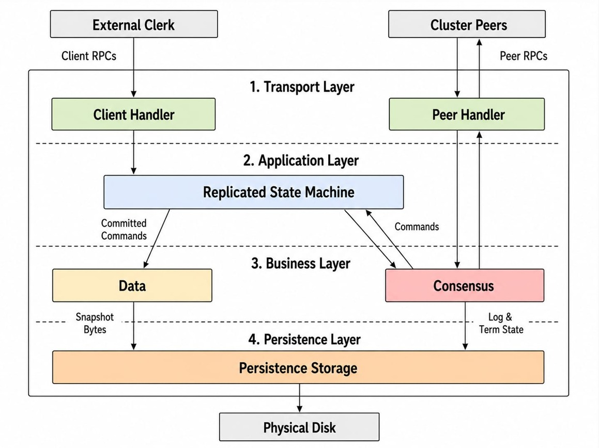
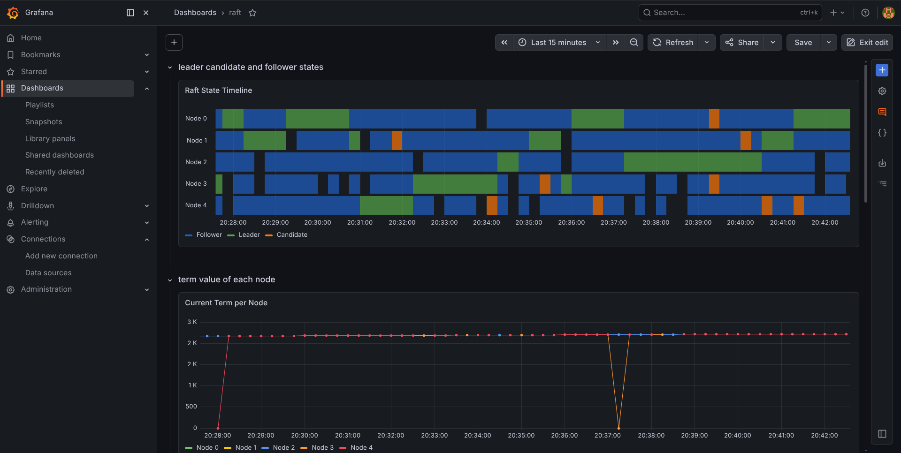
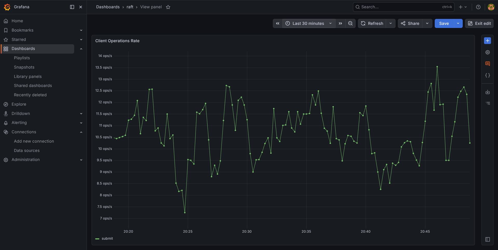
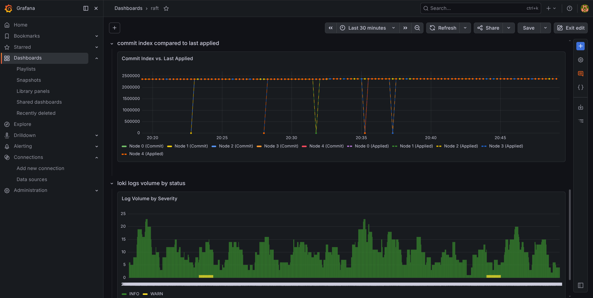

# Distributed Fault-Tolerant Key-Value Store (Raft)

This repository implements a high-performance, distributed key-value store built on top of the **Raft Consensus Algorithm**. The project features a robust **Go** cluster backend, type-safe **gRPC** interfaces, and an asynchronous **Java** client SDK. It achieves linearizable consistency and high availability despite node crashes or network partitions.

---

## Project Architecture

The system is organized around the **Replicated State Machine (RSM)** architecture, allowing multiple independent servers to maintain identical state machines by executing a synchronized log of commands.



### Repository Structure

-   [kvraft](raft-algorithm-thesis/kvraft): The Go core implementation containing:
    -   **Raft Engine**: Consensus logic, leader elections, and log replication.
    -   **Replicated State Machine (RSM)**: Decouples Raft consensus from the application state database.
    -   **KV Server**: gRPC server handling consensus coordination.
    -   **Clerk (Go SDK & CLI)**: Client library supporting automatic leader discovery and failovers.
    -   **Chaos Monkey**: Automated script to simulate cluster failures and partition events.
-   [kvraft-client-java](raft-algorithm-thesis/kvraft-client-java): An asynchronous Java client SDK built on `CompletableFuture` for interacting with the Go KV cluster.
-   [proto](raft-algorithm-thesis/proto): Shared Protocol Buffer definitions (`kv.proto`, `raft.proto`) defining client APIs and consensus RPCs.

---

## Core Concepts

### 1. The Raft Consensus Algorithm
Raft ensures that all active nodes in a cluster agree on a replicated log of operations. It is divided into three subproblems:
*   **Leader Election**: If a leader fails, follower nodes time out and start an election. A new leader is elected by obtaining votes from a majority of the cluster.
*   **Log Replication**: The leader receives operations from clients, appends them to its log, and broadcasts them to followers via AppendEntries.
*   **Safety**: Only nodes with the most up-to-date logs can win elections, ensuring committed entries are never overwritten.

### 2. The Replicated State Machine (RSM)
Located in `kvraft/internal/rsm`, the RSM layer acts as a buffer between the consensus log (Raft) and the key-value database:
-   **Deterministic Execution**: Every replica applies committed log entries to its database in the exact same order.
-   **Log Compaction (Snapshotting)**: When the Raft log grows too large, the RSM creates a snapshot of the state database, allowing Raft to discard older log entries to save memory/disk and speed up recovery times.
-   **Operation Lifecycle**: Clients submit operations. The RSM issues the command to Raft, blocks on a Go channel waiting for a quorum commitment, applies it to the state database, and returns the result.

### 3. gRPC & Cross-Language Interoperability
Using **gRPC** over Protocol Buffers (`proto/`) decouples client SDKs from the server's internal language:
*   [proto/kv.proto](raft-algorithm-thesis/proto/kv.proto) defines the client API (`Get` and `Put` operations).
*   [proto/raft.proto](raft-algorithm-thesis/proto/raft.proto) defines internal peer-to-peer RPCs (`RequestVote`, `AppendEntries`, and `InstallSnapshot`).
*   This makes it easy to write clients in multiple languages (such as Java, Go, or Python) that communicate transparently with the Go cluster.

---

## Getting Started

### Prerequisites
-   **Go 1.21+** (for Go server and tools)
-   **Java 21+** and **Maven 3.8+** (for Java client)
-   **Docker** and **Docker Compose**
-   **Protocol Buffers Compiler (`protoc`)**

### 1. Compile Protobuf Definitions
To generate or update client and server RPC stubs from the shared [proto](raft-algorithm-thesis/proto) definitions:
```bash
# Generate Go code (run from workspace root)
protoc --go_out=kvraft --go_opt=module=kvraft --go-grpc_out=kvraft --go-grpc_opt=module=kvraft proto/raft.proto proto/kv.proto

# Generate Java code
cd kvraft-client-java
mvn clean compile
```

### 2. Spin up the Go KVRaft Cluster
You can generate a local topology and configure environment variables using the Python setup script:
```bash
cd kvraft

# Generate docker-compose config from cluster.json topology
./setup_cluster.py ../cluster.json

# Spin up the cluster in the background
docker-compose up -d --build
```

### 3. Interact via the Go CLI Client
Use the Go CLI `kvcli` to read and write key-value pairs in the cluster:
```bash
cd kvraft
go build -o kvcli ./cmd/cli

# Put a value
./kvcli --config ../cluster.json put username johndoe

# Get a value
./kvcli --config ../cluster.json get username
```

### 4. Interact via the Java Client SDK
The Java SDK (`kvraft-client-java`) uses `CompletableFuture` for non-blocking asynchronous operations. It automatically resolves leader hints and handles client-side retries.

To test the Java client connecting to the running Docker cluster:
```bash
cd kvraft-client-java
mvn exec:java -Dexec.mainClass="com.kvraft.Main"
```

---

## Observability & Monitoring

The Docker Compose configuration automatically boots a full monitoring stack including **Prometheus**, **Grafana**, **Loki**, and **Promtail**.

*   **Grafana Dashboards**: Open [http://localhost:3000](http://localhost:3000) (admin / admin).
*   **Prometheus Metrics**: Open [http://localhost:9090](http://localhost:9090).

### Key Dashboards Included:
1.  **Raft Consensus Timeline**: Track node states (Follower, Candidate, Leader) and election changes.
    
2.  **Replication Rate**: Live charts monitoring throughput and applied operations.
    
3.  **Loki Log Stream**: Correlate system logs from all nodes in real time.
    

---

## Chaos Engineering Demo

To evaluate the resilience of the cluster under stress, use the automated `chaos_monkey.py` tool.

This script randomly stops (crashes) or pauses (network partitions / GC pauses) a minority of nodes (ensuring a consensus quorum is maintained), then recovers them.

```bash
cd kvraft
# Run chaos simulations
./chaos_monkey.py --config ../cluster.json
```
Watch Grafana during the execution to witness terms incrementing and leader elections resolving automatically as nodes crash and recover.
