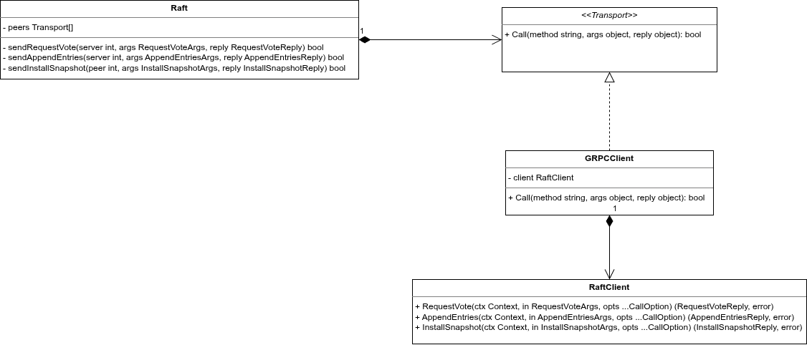
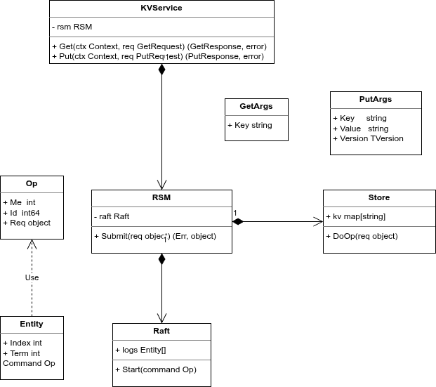
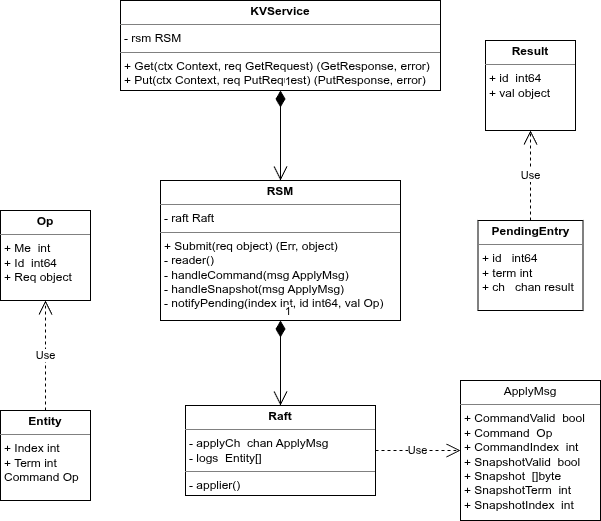
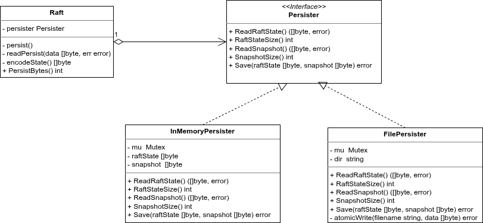

# KVRaft: Distributed Fault-Tolerant Key-Value Store

This project is a high-performance, distributed key-value store built on top of the **Raft Consensus Algorithm**. It provides linearizable consistency and high availability despite node failures or network partitions.

## Overview: The Raft Algorithm

### What is Raft?
Raft is a consensus algorithm that manages a replicated log and ensures that all nodes in a cluster eventually agree on the same sequence of operations, even if some nodes fail.

### How it Works
Raft decomposes the consensus problem into three relatively independent subproblems:
1.  **Leader Election**: When a cluster starts or an existing leader fails, a new leader is elected through a randomized timeout and voting process.
2.  **Log Replication**: The leader accepts client commands, appends them to its log, and replicates them to other nodes (Followers).
3.  **Safety**: Raft ensures that if any node has applied a particular log entry to its state machine, then no other node can apply a different command for the same log index.

### Raft Terms: The Logical Clock
Raft divides time into **Terms** of arbitrary length. Each term begins with an election.
- **Monotonicity**: Terms are numbered with consecutive integers. They act as a logical clock that allows nodes to detect obsolete information (like a stale leader from a previous term).
- **Term Propagation**: Nodes exchange their current term in every RPC. If a node's term is smaller than a peer's, it immediately updates its term and reverts to the "Follower" state.
- **Integrity**: A candidate must have a log that is "at least as up-to-date" as a majority of the cluster to be elected, ensuring committed entries are never lost.

---

## Architecture: The RSM Layer

The **Replicated State Machine (RSM)** is the core architectural pattern that makes this system work.

-   **Logic Separation**: The RSM layer (found in `internal/rsm`) acts as a buffer between the raw consensus log (Raft) and the application logic (the KV Store).
-   **Deterministic Execution**: All replicas start in the same state and apply the same commands in the same order. This ensures they all stay in sync.
-   **Snapshotting**: When the Raft log grows too large, the RSM takes a snapshot of the current state and instructs Raft to discard the old log entries, saving disk space and speeding up recovery.

### The Lifecycle of an Operation
A critical guarantee of this architecture is that **no operation returns to the user until it is committed and applied**.

1.  **Submission**: The RSM receives a request and calls `Raft.Start()`.
2.  **Consensus Wait**: The RSM blocks on a internal Go channel, waiting for Raft to achieve a majority (quorum).
3.  **Commitment**: Once Raft reaches consensus, the entry is marked as **committed**.
4.  **Application**: Raft pushes the committed entry through the `applyCh`.
5.  **Execution**: The RSM background reader picks up the message, executes it against the local KV store, and finally signals the blocked `Submit` call.

> [!IMPORTANT]
> If a leader fails before the entry is committed, the RSM will detect the term change or timeout and return `ErrWrongLeader`, prompting the client to retry. This ensures that only successfully replicated side-effects are ever visible to the client.

### Connection to MIT 6.824
This project is inspired by the **MIT 6.824 (Distributed Systems)** labs. It follows the rigorous design principles of lab 3 and 4, reaching beyond the academic implementation by using production-ready technologies like gRPC and Zap logging.

---

## The KV Server Concept

The KV Server provides a simple interface: `Get(key)` and `Put(key, value)`. 

### Real World: etcd
In the real world, projects like **etcd** use this exact structure to store the "source of truth" for entire cloud clusters. If your KV store is fault-tolerant, your entire system can recover from almost any hardware failure.

### System Orchestration (`node.go`)
In `internal/kvserver/node.go`, we find the "Orchestrator" of the system. A `Node` instance encapsulates:
1.  **A Raft instance**: To reach consensus.
2.  **An RSM instance**: To manage the application state.
3.  **A gRPC Server**: To listen for client requests and peer-to-peer communication.

While there are multiple server instances to ensure fault tolerance, there is typically only one **Clerk** (client) instance per application session.

---

## The Clerk & Client SDK

The **Clerk** (implemented in `pkg/clerk`) is the SDK for the project.

-   **Abstraction**: The user doesn't need to know which node is the leader. They just call `clerk.Put("key", "value")`.
-   **Leader Discovery**: The Clerk maintains a list of server addresses. If a request fails or returns `ErrWrongLeader`, the Clerk automatically tries the next server in the list until it finds the current leader.
-   **Linearizability**: The Clerk uses unique IDs for every operation, ensuring that even if a request is retried due to a timeout, it is never executed twice by the RSM.

---

## Transportation: gRPC and Extensibility

This project uses **gRPC** for both client-to-server and server-to-server communication.

-   **Why gRPC?**: It provides strongly-typed interfaces via Protocol Buffers, built-in support for streaming, and excellent performance.
-   **Extensibility**: Using `grpc.NewClient` and protobuf definitions makes it trivial to write a Clerk in **Python, Java, or Rust** and have it interact with this Go-based KV cluster.

---

## Getting Started

### 1. Generate Proto Files
If you modify the `.proto` files in the shared `proto/` directory at the project root, regenerate the Go code from the root:
```bash
protoc --go_out=kvraft --go_opt=module=kvraft --go-grpc_out=kvraft --go-grpc_opt=module=kvraft proto/raft.proto proto/kv.proto
```

### 2. Build and Run
If you want to use the local CLI tool to interact with the cluster, build it natively:
```bash
go build -o kvcli ./cmd/cli
```

To configure and run the cluster using Docker:
```bash
# Generate a docker-compose.yml based on your cluster.json configuration
./generate_compose.py ../cluster.json

# Start the generated cluster in the background
docker-compose up -d --build
```

To use the Go client (clerk) CLI:
```bash
# Store a value
./kvcli --config ../cluster.json put mykey myvalue

# Retrieve a value
./kvcli --config ../cluster.json get mykey
```

When you are finished testing, cleanly shut down the cluster:
```bash
docker-compose down
```

## Design Patterns

- Creational: Static Factory Pattern
- Structural: Adapter Pattern
- Behavioral: Command Pattern, Observer Pattern, Strategy Pattern

### Static Factory Pattern

In a distributed system like Raft, components have complex initialization requirements:
1.  **Dependency Injection**: They require loggers, network transports, and persistence layers.
2.  **State Initialization**: They must recover their state from persistent storage before becoming active.
3.  **Concurrency**: They rely on multiple background goroutines to manage timers (elections, heartbeats), log application, and peer replication.
4.  **Encapsulation**: Using a factory allows the implementation details (struct fields) to remain private while returning a clean interface or pointer.

By using the Factory Pattern (via `Make` and `MakeRSM`), we ensure that a node is never in a partially initialized or invalid state when it starts its execution loop.

---

#### 1. Raft Component

The Raft component uses a static factory function `Make` to initialize the consensus engine.

##### Relevant Code: Raft

###### The Struct
```go
// Taken from internal/raft/raft.go
type Raft struct {
	mu        sync.RWMutex
	logger    *zap.Logger
	peers     []Transport
	persister Persister
	me        int
	dead      int32

	applyCh        chan raftapi.ApplyMsg
	applyCond      *sync.Cond
	replicatorCond []*sync.Cond

	state       NodeState
	currentTerm int
	votedFor    int
	currentLeader int
	logs        []Entry

	commitIndex int
	lastApplied int
	nextIndex   []int
	matchIndex  []int

	lastIncludedIndex int
	lastIncludedTerm  int

	electionTimer  *time.Timer
	heartBeatTimer *time.Timer
}
```

###### The Factory Function
```go
// Taken from internal/raft/raft.go
func Make(peers []Transport, me int,
	persister Persister, applyCh chan raftapi.ApplyMsg, logger *zap.Logger) raftapi.Raft {

	rf := &Raft{
		peers:          peers,
		persister:      persister,
		me:             me,
		dead:           0,
		applyCh:        applyCh,
		replicatorCond: make([]*sync.Cond, len(peers)),
		state:          StateFollower,
		currentTerm:    0,
		votedFor:       -1,
		currentLeader:  -1,
		logs:           make([]Entry, 1),
		nextIndex:      make([]int, len(peers)),
		matchIndex:     make([]int, len(peers)),
		heartBeatTimer: time.NewTimer(StableHeartbeatTimeout()),
		electionTimer:  time.NewTimer(RandomizedElectionTimeout()),
		logger:         logger.With(zap.Int("node", me)),
	}

	for i := range peers {
		rf.replicatorCond[i] = sync.NewCond(&rf.mu)
		if i != me {
			go rf.replicator(i) // Background Replication Task
		}
	}

	rf.readPersist(persister.ReadRaftState())
	rf.applyCond = sync.NewCond(&rf.mu)

	go rf.ticker()  // Background Logic Task
	go rf.applier() // Background State Machine Task
	return rf
}
```

##### Raft Background Tasks

1.  **`rf.ticker()`**: 
    - **Purpose**: Manages time-based events in Raft.
    - **Logic**: It waits on `electionTimer` and `heartBeatTimer`. If an election timeout occurs and the node isn't a leader, it starts an election. If it is a leader and a heartbeat timeout occurs, it triggers log replication.
    ```go
    // Taken from internal/raft/raft.go
    func (rf *Raft) ticker() {
        for rf.killed() == false {
            select {
            case <-rf.electionTimer.C:
                rf.mu.Lock()
                if rf.state == StateLeader {
                    rf.resetElectionTimer()
                } else {
                    rf.becomeCandidate()
                }
                rf.mu.Unlock()

            case <-rf.heartBeatTimer.C:
                rf.mu.Lock()
                if rf.state == StateLeader {
                    rf.signalBroadcastReplication(true)
                    rf.resetHeartbeatTimer()
                }
                rf.mu.Unlock()
            }
        }
    }
    ```

2.  **`rf.applier()`**:
    - **Purpose**: Decouples the consensus logic from the state machine application.
    - **Logic**: It waits for `applyCond` to be signaled (whenever `commitIndex` increases). It then pushes committed entries or snapshots into the `applyCh` to be consumed by the RSM.
    ```go
    // Taken from internal/raft/raft.go
    func (rf *Raft) applier() {
        defer close(rf.applyCh)
        for !rf.killed() {
            rf.mu.Lock()
            for rf.lastApplied >= rf.commitIndex {
                rf.applyCond.Wait()
                if rf.killed() {
                    rf.mu.Unlock()
                    return
                }
            }
            // ... logic to prepare entries/snapshot ...
            rf.mu.Unlock()
            for _, entry := range entries {
                rf.applyCh <- raftapi.ApplyMsg{
                    CommandValid: true,
                    Command:      entry.Command,
                    CommandIndex: entry.Index,
                }
            }
        }
    }
    ```

3.  **`rf.replicator(peer)`**:
    - **Purpose**: Optimizes replication by managing a dedicated goroutine for each peer.
    - **Logic**: It waits on `replicatorCond[peer]`. When signaled, it checks if the peer needs new entries and calls `replicateToPeer`. This ensures that slow peers don't block the main Raft logic.
    ```go
    // Taken from internal/raft/raft.go
    func (rf *Raft) replicator(peer int) {
        rf.mu.Lock()
        defer rf.mu.Unlock()
        for !rf.killed() {
            for !rf.needsReplication(peer) {
                rf.replicatorCond[peer].Wait()
            }
            rf.mu.Unlock()
            rf.replicateToPeer(peer)
            rf.mu.Lock()
        }
    }
    ```

---

#### 2. Replicated State Machine (RSM) Component

The RSM component acts as a bridge between the KV Server and Raft. It uses `MakeRSM` as its factory.

##### Relevant Code: RSM

###### The Struct
```go
// Taken from internal/rsm/rsm.go
type RSM struct {
	mu           sync.Mutex
	me           int
	rf           raftapi.Raft
	applyCh      chan raftapi.ApplyMsg
	maxRaftState int // snapshot if log grows this big
	sm           StateMachine
	pending      map[int]*pendingEntry
	lastApplied  int
	logger       *zap.Logger
}
```

#### The Factory Function
```go
// Taken from internal/rsm/rsm.go
func MakeRSM(servers []raft.Transport, me int, persister raft.Persister, maxRaftState int, sm StateMachine, logger *zap.Logger) *RSM {
	rsm := &RSM{
		me:           me,
		maxRaftState: maxRaftState,
		applyCh:      make(chan raftapi.ApplyMsg),
		sm:           sm,
		pending:      make(map[int]*pendingEntry),
		logger:       logger.With(zap.Int("node", me), zap.String("component", "rsm")),
	}
	if !useRaftStateMachine {
		rsm.rf = raft.Make(servers, me, persister, rsm.applyCh, logger)
	}
	if snapshot, _ := persister.ReadSnapshot(); len(snapshot) > 0 {
		rsm.sm.Restore(snapshot)
	}
	rsm.logger.Info("RSM started", zap.Int("maxRaftState", maxRaftState))

	go rsm.reader() // Background Processing Task
	return rsm
}
```

##### RSM Background Tasks

1.  **`rsm.reader()`**:
    - **Purpose**: Processes the stream of committed messages coming from Raft.
    - **Logic**: It loops over `applyCh`. For each message, it either restores a snapshot or executes a command using the `StateMachine` interface. It also wakes up any client requests waiting in `pending` and triggers snapshots if the log size exceeds `maxRaftState`.
    ```go
    // Taken from internal/rsm/rsm.go
    func (rsm *RSM) reader() {
        for msg := range rsm.applyCh {
            if msg.SnapshotValid {
                rsm.handleSnapshot(msg)
            } else if msg.CommandValid {
                rsm.handleCommand(msg)
            } else {
                rsm.logger.Error("reader: invalid command msg")
            }
        }
        rsm.cleanup()
    }
    ```

---

### Adapter Pattern

The Adapter pattern is a structural design pattern that allows objects with incompatible interfaces to collaborate. It acts as a wrapper that converts one interface into another that a client expects. In this project, it allows the Raft consensus core to communicate over gRPC without being coupled to the gRPC-specific API.

#### Purpose and Rationale

The Raft algorithm requires nodes to communicate with each other via Remote Procedure Calls (RPCs). However, hardcoding a specific communication library (like gRPC) directly into the Raft core would make the system rigid and difficult to test or evolve.

By using the Adapter pattern, we:
1.  **Decouple the Core**: The `Raft` struct only knows about a simple, generic `Transport` interface.
2.  **Ensure Extensibility**: We can easily switch from gRPC to another protocol (e.g., plain TCP, Go's native RPC, or even a mock transport for testing) by simply providing a different adapter implementation.
3.  **Handle Strict Typing**: gRPC requires specific, generated types and context management. The adapter handles all these details, presenting a clean, unified interface to the Raft core.

---



#### 1. The Target Interface: `Transport`
*Source: [transport.go](kvraft/internal/raft/transport.go)*

This is the interface that the Raft core expects. It is intentionally kept simple, using generic types and a string-based method name to remain protocol-agnostic. This simplicity allows the Raft core to remain unchanged regardless of the communication layer.

```go
package raft

type Transport interface {
	Call(method string, args interface{}, reply interface{}) bool
}
```

---

#### 2. The Adaptee: `RaftClient` (gRPC)
*Source: [raft_grpc.pb.go]kvraft/pb/raft_grpc.pb.go)*

This is the generated gRPC client API. It has strict requirements: it needs a `context.Context` and uses specific pointer types for arguments and replies. Its interface is incompatible with the simple `Transport` interface.

```go
type RaftClient interface {
	RequestVote(ctx context.Context, in *RequestVoteArgs, opts ...grpc.CallOption) (*RequestVoteReply, error)
	AppendEntries(ctx context.Context, in *AppendEntriesArgs, opts ...grpc.CallOption) (*AppendEntriesReply, error)
	InstallSnapshot(ctx context.Context, in *InstallSnapshotArgs, opts ...grpc.CallOption) (*InstallSnapshotReply, error)
}
```

---

#### 3. The Adapter: `GRPCClient`
*Source: [client.go](kvraft/raftransport/client.go)*

The `GRPCClient` struct implements the `Transport` interface. It wraps the gRPC `RaftClient` and "adapts" the generic `Call` method into specific gRPC method calls, performing the necessary type assertions and data conversions.

```go
package raftransport

import (
	"context"
	"time"

	"kvraft/internal/raft"
	kvpb "kvraft/pb"
)

const rpcTimeout = 2 * time.Second

// GRPCClient implements raft.Transport using a Raft gRPC client stub.
type GRPCClient struct {
	Raft kvpb.RaftClient
}

func (c *GRPCClient) Call(method string, args interface{}, reply interface{}) bool {
	ctx, cancel := context.WithTimeout(context.Background(), rpcTimeout)
	defer cancel()

	switch method {
	case "Raft.RequestVote":
		a := args.(*raft.RequestVoteArgs)
		r := reply.(*raft.RequestVoteReply)
		res, err := c.Raft.RequestVote(ctx, &kvpb.RequestVoteArgs{
			Term:         int32(a.Term),
			CandidateId:  int32(a.CandidateId),
			LastLogTerm:  int32(a.LastLogTerm),
			LastLogIndex: int32(a.LastLogIndex),
		})
		if err != nil {
			return false
		}
		r.Term = int(res.Term)
		r.VoteGranted = res.VoteGranted
		return true

	case "Raft.AppendEntries":
		a := args.(*raft.AppendEntriesArgs)
		r := reply.(*raft.AppendEntriesReply)
		entries, err := entriesToProto(a.Entries)
		if err != nil {
			return false
		}
		res, err := c.Raft.AppendEntries(ctx, &kvpb.AppendEntriesArgs{
			Term:         int32(a.Term),
			LeaderId:     int32(a.LeaderId),
			PrevLogIndex: int32(a.PrevLogIndex),
			PrevLogTerm:  int32(a.PrevLogTerm),
			Entries:      entries,
			LeaderCommit: int32(a.LeaderCommit),
		})
		if err != nil {
			return false
		}
		r.Term = int(res.Term)
		r.Success = res.Success
		r.ConflictIndex = int(res.ConflictIndex)
		r.ConflictTerm = int(res.ConflictTerm)
		return true

	case "Raft.InstallSnapshot":
		a := args.(*raft.InstallSnapshotArgs)
		r := reply.(*raft.InstallSnapshotReply)
		res, err := c.Raft.InstallSnapshot(ctx, &kvpb.InstallSnapshotArgs{
			Term:              int32(a.Term),
			LeaderId:          int32(a.LeaderId),
			LastIncludedIndex: int32(a.LastIncludedIndex),
			LastIncludedTerm:  int32(a.LastIncludedTerm),
			Data:              a.Data,
		})
		if err != nil {
			return false
		}
		r.Term = int(res.Term)
		return true

	default:
		return false
	}
}
```

---

#### 4. Supporting Code: Data Transformation
*Source: [codec.go](kvraft/raftransport/codec.go)*

These functions handle the serialization and deserialization of the log entries. Since internal commands are stored as `interface{}`, they are encoded using `gob` before being sent over the wire via gRPC.

```go
package raftransport

import (
	"bytes"
	"encoding/gob"
	"fmt"

	"kvraft/internal/raft"
	kvpb "kvraft/pb"
)

func entriesToProto(entries []raft.Entry) ([]*kvpb.LogEntry, error) {
	out := make([]*kvpb.LogEntry, len(entries))
	for i := range entries {
		var buf bytes.Buffer
		if err := gob.NewEncoder(&buf).Encode(&entries[i].Command); err != nil {
			return nil, err
		}
		out[i] = &kvpb.LogEntry{
			Index:   int32(entries[i].Index),
			Term:    int32(entries[i].Term),
			Command: buf.Bytes(),
		}
	}
	return out, nil
}

func entriesFromProto(entries []*kvpb.LogEntry) ([]raft.Entry, error) {
	out := make([]raft.Entry, len(entries))
	for i, e := range entries {
		dec := gob.NewDecoder(bytes.NewReader(e.Command))
		var cmd any
		if err := dec.Decode(&cmd); err != nil {
			return nil, fmt.Errorf("decode command: %w", err)
		}
		out[i] = raft.Entry{
			Index:   int(e.Index),
			Term:    int(e.Term),
			Command: cmd,
		}
	}
	return out, nil
}
```

---

#### 5. Initiating the Calls (The Client Site)
*Source: [raft.go](kvraft/internal/raft/raft.go)*

The Raft core uses the provided `Transport` implementations (stored in `rf.peers`) to communicate. Not only is the code simpler, but it's also completely decoupled from gRPC specifics.

```go
func (rf *Raft) sendRequestVote(server int, args *RequestVoteArgs, reply *RequestVoteReply) bool {
	ok := rf.peers[server].Call("Raft.RequestVote", args, reply)
	return ok
}

func (rf *Raft) sendAppendEntries(server int, args *AppendEntriesArgs, reply *AppendEntriesReply) bool {
	ok := rf.peers[server].Call("Raft.AppendEntries", args, reply)
	return ok
}

func (rf *Raft) sendInstallSnapshot(peer int, args *InstallSnapshotArgs, reply *InstallSnapshotReply) bool {
	ok := rf.peers[peer].Call("Raft.InstallSnapshot", args, reply)
	return ok
}
```

#### Conclusion

The use of the Adapter pattern in KVRaft is a classic example of **programming to an interface, not an implementation**. By wrapping the gRPC-specific client logic within the `GRPCClient` adapter, we ensure that the core Raft consensus algorithm remains clean, maintainable, and easily adaptable to other communication technologies in the future.

---

### Command Pattern

The **Command Pattern** is a behavioral design pattern that turns a request into a stand-alone object that contains all information about the request. In this project, the Command pattern is the fundamental mechanism used to encapsulate client operations (like `Get` or `Put`) so they can be reliably replicated across a Raft cluster and executed deterministically by every node.



#### Phase 0: Client Initiation

The lifecycle of a command begins with the `Clerk` (the client library). It wraps the user's intent into a gRPC request and sends it to the cluster leader.

```go
// Source: pkg/clerk/clerk.go
func (ck *Clerk) Put(key string, value string, version api.TVersion) api.Err {
	// ... setup and leader discovery ...
	for {
		resp, err := ck.clients[srv].Put(cctx, &kvpb.PutRequest{
			Key:     key,
			Value:   value,
			Version: uint64(version),
		})
		// ... retry logic ...
	}
}
```

#### Phase 1: The Command Object (`Op`)

When the server receives the gRPC request, the `RSM` (Replicated State Machine) creates an `Op` object. This is our "Command" object.

```go
// Source: internal/rsm/rsm.go
type Op struct {
	Me  int
	Id  int64 // Unique ID to match Submit with the applied result
	Req any
}
```

The concrete requests that live inside `Op.Req` are also defined as simple data structures:

```go
// Source: api/kv.go
type GetArgs struct {
	Key string
}

type PutArgs struct {
	Key     string
	Value   string
	Version TVersion
}
```

#### 2. Encapsulation: The `Submit` Flow

When a client request arrives at the server, the `RSM` (Replicated State Machine) acts as the **Invoker**. It wraps the request into an `Op` object and hands it to Raft for agreement.

```go
// Source: internal/rsm/rsm.go
func (rsm *RSM) Submit(req any) (api.Err, any) {
	id := randValue()
	op := Op{Me: rsm.me, Id: id, Req: req}
	// ... 
	index, term, isLeader := rsm.rf.Start(op)
	// ... 
}
```

#### Phase 3: Consensus & Internal Replication

A key benefit of the Command pattern here is that the **Raft** layer is completely decoupled from the actual business logic. Raft treats the `Op` (the Command) as an opaque `interface{}`/`any`. It doesn't know what a "Put" or "Get" is; its only job is to ensure that all nodes agree on the sequence of these commands.
The leader sends the command to followers using `AppendEntries` RPCs.

```go
// Source: internal/raft/raft.go
func (rf *Raft) replicateToPeer(peer int) {
	// ... check nextIndex ...
	prevLogIndex := rf.nextIndex[peer] - 1
	args := rf.genAppendEntriesArgs(prevLogIndex) // Includes the Command in args.Entries
	// ... send RPC ...
}
```


```go
// Source: internal/raft/raft.go
func (rf *Raft) Start(command interface{}) (int, int, bool) {
	rf.mu.Lock()
	defer rf.mu.Unlock()
	if rf.state != StateLeader {
		return -1, -1, false
	}
	newIndex := rf.getLen()
	newTerm := rf.currentTerm
	entry := Entry{
		Index:   newIndex,
		Term:    newTerm,
		Command: command, // Opaque storage
	}
	rf.logs = append(rf.logs, entry)
	rf.persist()
	rf.logger.Debug("received new command", zap.Int("index", newIndex), zap.Int("term", newTerm))
	rf.signalBroadcastReplication(false)
	return newIndex, newTerm, true
}
```

#### 4. Dispatch and Execution

Once Raft reaches consensus, the command is committed and "applied." The `RSM` receives the committed command back from Raft via a channel and dispatches it to the concrete **Receiver**—the `StateMachine`.

##### RSM Dispatch Logic
```go
// Source: internal/rsm/rsm.go
func (rsm *RSM) handleCommand(msg raftapi.ApplyMsg) {
	op, ok := msg.Command.(Op)
	// ... 
	resultVal := rsm.sm.DoOp(op.Req) // Execution
	// ... notify the original Submit call ...
}
```

##### Concrete Execution: The Store
The `Store` (state machine) implements the `DoOp` method, where the command is finally unwrapped and the actual logic is executed.

```go
// Source: internal/kvserver/store.go
func (s *Store) DoOp(req any) any {
	s.mu.Lock()
	defer s.mu.Unlock()

	switch x := req.(type) {
	case api.GetArgs:
		cur, ok := s.kv[x.Key]
		if !ok {
			return api.GetReply{Err: api.ErrNoKey}
		}
		return api.GetReply{Value: cur.Value, Version: cur.Version, Err: api.OK}

	case api.PutArgs:
        // ... Put logic ...
		s.kv[x.Key] = struct {
			Value   string
			Version api.TVersion
		}{Value: x.Value, Version: cur.Version + 1}
		return api.PutReply{Err: api.OK}

	default:
		return api.PutReply{Err: api.ErrWrongLeader}
	}
}
```

#### Why the Command Pattern?

Using the Command pattern in this project provides several critical advantages:

1.  **Decoupling of Concerns**: The Raft algorithm is complex enough on its own. By treating operations as commands, Raft doesn't need to change if we add a new feature (like `Delete` or `Append`). It only cares about replicating `Op` objects.
2.  **Linearizability**: Since every node executes the commands in the exact same order (the Raft log order), the state of the KV store stays synchronized across the entire cluster.
3.  **Auditability and Persistence**: Commands are stored in the Raft log. If a node crashes and restarts, it can "replay" these commands from the log (or recovery from a snapshot) to rebuild its state, ensuring no data is lost.
4.  **Uniformity**: Whether it's a read-only `Get` or a write `Put`, the flow through the system is identical until the very last step in the `Store`. This simplifies error handling and consensus logic.

---

### Observer Design Pattern

The **Observer Pattern** is a behavioral design pattern where an object (the **Subject**) maintains a list of its dependents (**Observers**) and notifies them automatically of any state changes, usually by calling one of their methods or sending signals.

In this project, the Observer pattern is implemented using **Go Channels**. Instead of maintaining a list of pointers to observers, the Subject "publishes" events into a channel, and the Observers "subscribe" by reading from that channel.

This pattern is used in two critical layers of the system:
1. **Raft Core to RSM**: Raft publishes committed log entries to an `applyCh`.
2. **RSM to Client**: The RSM notifies blocked client requests when their specific command has been applied to the state machine.

---


#### 1. Raft Core to RSM: The `applyCh`

The Raft consensus algorithm ensures that all nodes agree on a log of operations. Once a leader confirms that a majority of nodes have replicated an entry, it "commits" the entry. However, Raft itself doesn't know how to execute the command—it only handles the agreement. It must notify the **Replicated State Machine (RSM)** that a new command is ready to be executed.

##### The Message Contract
Defined in `kvraft/raftapi/raftapi.go`:

```go
// From: kvraft/raftapi/raftapi.go
type ApplyMsg struct {
	CommandValid bool
	Command      interface{}
	CommandIndex int

	SnapshotValid bool
	Snapshot      []byte
	SnapshotTerm  int
	SnapshotIndex int
}
```

##### The Publisher: Raft Applier
In the Raft implementation, a background goroutine called `applier` constantly monitors the `commitIndex`. When the council of nodes commits a new entry, the `applier` pushes it into the `applyCh`.

```go
// From: kvraft/internal/raft/raft.go
func (rf *Raft) applier() {
	defer close(rf.applyCh)

	for !rf.killed() {
		rf.mu.Lock()
		// Wait until there are new committed entries to apply
		for rf.lastApplied >= rf.commitIndex {
			rf.applyCond.Wait()
			if rf.killed() {
				rf.mu.Unlock()
				return
			}
		}

		// ... (Logic to handle snapshots or slice log entries) ...

		for _, entry := range entries {
			rf.applyCh <- raftapi.ApplyMsg{
				CommandValid: true,
				Command:      entry.Command,
				CommandIndex: entry.Index,
			}
		}
	}
}
```

##### The Subscriber: RSM Reader
The RSM starts a background `reader` goroutine that "subscribes" to the `applyCh` by looping over it.

```go
// From: kvraft/internal/rsm/rsm.go
func (rsm *RSM) reader() {
	for msg := range rsm.applyCh {
		if msg.SnapshotValid {
			rsm.handleSnapshot(msg)
		} else if msg.CommandValid {
			rsm.handleCommand(msg)
		} else {
			rsm.logger.Error("reader: invalid command msg")
		}
	}
	rsm.cleanup()
}
```

---

#### 2. RSM to Client: Notification Channels

When a client sends a request (e.g., `Put` or `Get`), the `Submit` method is called. This method cannot return immediately because it must wait for the command to flow through the Raft consensus and eventually be applied by the `reader` goroutine.

##### The Notification Struct
The RSM maintains a map of "pending" observers. Each observer is a channel waiting for a specific log index.

```go
// From: kvraft/internal/rsm/rsm.go
type result struct {
	id  int64
	val any
}

type pendingEntry struct {
	id   int64
	term int
	ch   chan result // The "Observer" channel
}
```

##### The Subscriber: `Submit` Method
The `Submit` method creates a unique channel, registers it in the `pending` map, and then **blocks** waiting for a signal.

```go
// From: kvraft/internal/rsm/rsm.go
func (rsm *RSM) Submit(req any) (api.Err, any) {
	id := randValue()
	op := Op{Me: rsm.me, Id: id, Req: req}
	ch := make(chan result) // Create the notification channel

	index, term, isLeader := rsm.rf.Start(op)
	if !isLeader {
		return api.ErrWrongLeader, rsm.rf.GetLeader()
	}

	// Subscribe: Register the channel to be notified at this log index
	rsm.mu.Lock()
	rsm.pending[index] = &pendingEntry{id: id, term: term, ch: ch}
	rsm.mu.Unlock()

	// Wait for the Observer notification or a timeout
	select {
	case res, ok := <-ch:
		if !ok || res.id != id {
			return api.ErrWrongLeader, rsm.rf.GetLeader()
		}
		return api.OK, res.val
	case <-time.After(10 * time.Second):
		return api.ErrWrongLeader, rsm.rf.GetLeader()
	}
}
```

##### The Publisher: `notifyPending`
Once the `reader` goroutine receives a committed message from Raft and applies it to the KV store, it notifies the waiting `Submit` call via the registered channel.

```go
// From: kvraft/internal/rsm/rsm.go
func (rsm *RSM) notifyPending(index int, id int64, val any) {
	entry, exists := rsm.pending[index]

	if exists {
		// Publish the result to the specific channel
		if entry.id == id {
			entry.ch <- result{id: id, val: val}
		} else {
			entry.ch <- result{id: -1} // Notify failure (leader changed)
		}
		delete(rsm.pending, index)
	}
}
```

---

#### Why Choose the Observer Pattern?

Using channels to implement the Observer pattern is far superior to traditional **busy-waiting** or **polling**:

1.  **Efficiency (CPU Usage)**: In busy-waiting, a goroutine would run a `for` loop, checking a variable over and over. This consumes 100% of a CPU core. With channels, the Go runtime **suspends** the goroutine. It uses **zero CPU cycles** while waiting.
2.  **Instant Notification**: As soon as data is pushed into a channel, the scheduler wakes up the waiting goroutine immediately. There is no "sleep interval" like in polling, which reduces latency.
3.  **Decoupling**: The Raft core doesn't need to know anything about the KV store. It just needs to know that *someone* is listening on the `applyCh`.

---

### Strategy Pattern

The Strategy pattern is a behavioral design pattern that turns a set of behaviors into objects and makes them interchangeable inside original context object. In our case, the "behavior" is how Raft state and snapshots are persisted to stable storage.



#### Why Use Strategy for Persistence?
Raft requires its state (current term, voted for, and log entries) to be saved on "stable storage" before responding to RPCs. However, "stable storage" can mean different things depending on the environment:
- **Production**: State must be written to a physical **disk** to survive node crashes and reboots.
- **Testing**: State can be kept in **memory** for speed and to easily simulate crashes/restarts without cluttering the file system.

By using the Strategy pattern, the Raft core doesn't need to know *where* or *how* the data is saved; it just knows it has a "Persister" that handles it.

#### The Implementation

##### The Strategy Interface: `Persister`
Located in: [`internal/raft/persister.go`](kvraft/internal/raft/persister.go)

This interface defines the contract that any persistence strategy must follow.

```go
package raft

type Persister interface {
	ReadRaftState() ([]byte, error)
	RaftStateSize() int
	ReadSnapshot() ([]byte, error)
	SnapshotSize() int
	Save(raftState []byte, snapshot []byte) error
}
```

---

##### Concrete Strategy 1: Disk Persistence (`FilePersister`)
Located in: [`persist/disk_persister.go`](kvraft/persist/disk_persister.go)

This implementation writes the Raft state and snapshots to actual files on the disk. It uses atomic renames to ensure that a crash during a write doesn't leave the system with corrupted state.

```go
package persist

import (
	"os"
	"path/filepath"
	"sync"
)

type FilePersister struct {
	mu  sync.Mutex
	dir string // e.g. "/var/lib/kvraft/node-0"
}

func (ps *FilePersister) Save(raftState []byte, snapshot []byte) error {
	ps.mu.Lock()
	defer ps.mu.Unlock()

	if err := ps.atomicWrite("raft-state", raftState); err != nil {
		return err
	}
	if err := ps.atomicWrite("snapshot", snapshot); err != nil {
		return err
	}
	return nil
}

func (ps *FilePersister) atomicWrite(filename string, data []byte) error {
	targetPath := filepath.Join(ps.dir, filename)
	tempPath := targetPath + ".tmp"

	f, err := os.OpenFile(tempPath, os.O_CREATE|os.O_WRONLY|os.O_TRUNC, 0644)
	if err != nil {
		return err
	}

	if _, err := f.Write(data); err != nil {
		_ = f.Close()
		return err
	}
	if err := f.Sync(); err != nil {
		_ = f.Close()
		return err
	}
	if err := f.Close(); err != nil {
		return err
	}

	return os.Rename(tempPath, targetPath)
}
```

---

##### Concrete Strategy 2: In-Memory Persistence (`Persister`)
Located in: [`internal/testutils/tester/persister.go`](kvraft/internal/testutils/tester/persister.go)

This implementation stores the state in simple byte slices in memory. It is extremely fast and ideal for unit tests where hundreds of "crashes" and "restarts" need to be simulated in seconds.

```go
package tester

import "sync"

type Persister struct {
	mu        sync.Mutex
	raftState []byte
	snapshot  []byte
}

func (ps *Persister) Save(raftState []byte, snapshot []byte) {
	ps.mu.Lock()
	defer ps.mu.Unlock()
	ps.raftState = clone(raftState)
	ps.snapshot = clone(snapshot)
}

func (ps *Persister) ReadRaftState() []byte {
	ps.mu.Lock()
	defer ps.mu.Unlock()
	return clone(ps.raftState)
}
```

> [!NOTE]
> *In the test harness, an **Adapter** is used to wrap the `tester.Persister` so it matches the `raft.Persister` interface (adding the required error return values).*

---

#### How the Strategy is Swapped

The selection of the strategy happens during the initialization of the Raft node. The `raft.Make` function accepts the `Persister` interface as an argument.

##### The Context: `Raft` Struct
Located in: [`internal/raft/raft.go`](kvraft/internal/raft/raft.go)

```go
type Raft struct {
	// ... other fields ...
	persister Persister // The strategy is stored here
	// ...
}

func Make(peers []Transport, me int,
	persister Persister, applyCh chan raftapi.ApplyMsg, logger *zap.Logger) raftapi.Raft {
	
	rf := &Raft{
		// ...
		persister: persister, // Injection of the strategy
		// ...
	}
    rf.readPersist(persister.ReadRaftState())
	// ...
}

func (rf *Raft) persist() {
    snapshot, _ := rf.persister.ReadSnapshot()
    err := rf.persister.Save(rf.encodeState(), snapshot)
    if err != nil {
        rf.logger.Fatal("failed to persist", zap.Error(err))
    }
}
```

##### Swapping in Production
In the actual KV server, we instantiate the `FilePersister` and pass it to Raft.
Located in: [`internal/kvserver/node.go`](kvraft/internal/kvserver/node.go)

```go
ps, err := persist.MakeFilePersister(dataDir)
if err != nil {
    return nil, err
}
// ...
rf := raft.Make(transports, me, ps, applyCh, logger)
```

##### Swapping in Tests
In the test suite, the harness creates an in-memory persister and passes it (via an adapter) to Raft.
Located in: [`internal/raft/server_test.go`](kvraft/internal/raft/server_test.go)

```go
p := &persisterAdapter{p: persister} // 'persister' is a *tester.Persister
s.raft = Make(transports, srv, p, applyCh, logger)
```

#### 5. Conclusion

By using the **Strategy Pattern**, we achieved:
1.  **Separation of Concerns**: Raft focuses on consensus logic, while persistence logic is isolated.
2.  **Testability**: We can test complex Raft failure scenarios without the overhead of disk I/O.
3.  **Extensibility**: If we ever want to save state to a database (like LevelDB or Postgres) instead of raw files, we simply need to implement a new `Persister` strategy without touching the Raft core code.
